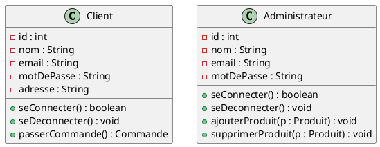
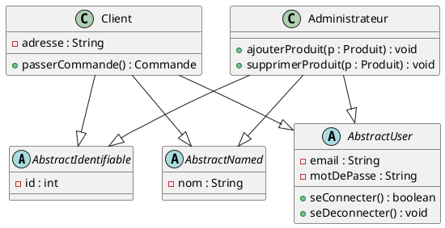

# UML Enhancing Tool

A tool that enhances UML class diagrams by automatically discovering and extracting abstract classes using Formal Concept Analysis (FCA) and AI-powered semantic naming.

## Overview

This tool processes UML diagrams in PlantUML format and identifies opportunities for abstraction by:

1. **Parsing**: Transforms PlantUML diagrams into knowledge graphs
2. **FCA Analysis**: Discovers formal concepts (shared attributes/methods) using FCA4J
3. **Concept Filtering**: Applies relevance scoring to identify meaningful abstractions
4. **Semantic Naming**: Generates meaningful names using LLM or intelligent fallback
5. **Diagram Enhancement**: Produces improved PlantUML with abstract classes and inheritance
6. **Quality Evaluation**: Exports metrics for assessing abstraction quality

## Key Features

### Core Capabilities
- ✅ **PlantUML Support**: Full parsing including cardinality, visibility modifiers, methods
- ✅ **Private Field Support**: Correctly analyzes both public (`+`) and private (`-`) members
- ✅ **Knowledge Graph**: NetworkX-based representation for analysis
- ✅ **Formal Concept Analysis**: FCA4J integration with XML output parsing
- ✅ **Hierarchical Concepts**: Multi-level lattice traversal for complex abstractions
- ✅ **Inherited Feature Removal**: Automatically cleans up child classes
- ✅ **AI-Powered Naming**: Semantic class names via OpenAI/Anthropic LLMs

### Recent Enhancements (v1.1)
- 🆕 **Improved Relevance Scoring**: Intent-focused formula prioritizing rich concepts (3+ attributes get 1.5x boost)
- 🆕 **Semantic Fallback Naming**: Intelligent naming when LLM unavailable
  - Authentication patterns → `AbstractUser` / `AbstractAuthenticatable`
  - ID fields → `AbstractIdentifiable` / `AbstractEntity`
  - Name fields → `AbstractNamed` / `AbstractTitled`
- 🆕 **XML-Safe Attributes**: Handles generic types (`List<T>`) in FCA export
- 🆕 **Tuned Default Threshold**: 45.0 relevance score captures meaningful abstractions

### Quality & Testing
- 📊 **75%+ Test Coverage**: 38 passing unit/integration tests
- 📋 **Evaluation Metrics**: Automated CSV export for quality assessment
- 📝 **Comprehensive Logging**: Step-by-step pipeline execution tracking

## Installation

```bash
# Clone the repository
git clone https://github.com/DrHurel/uml-enhancing-tool.git
cd uml-enhancing-tool

# Create virtual environment
python -m venv .venv
source .venv/bin/activate  # Windows: .venv\Scripts\activate

# Install dependencies
pip install -r requirements.txt

# Download FCA4J (if not present)
# Place fca4j-cli-0.4.4.jar in project root
```

## Quick Start

```bash
# Basic usage
python main.py -i examples/e-commerce.puml

# With custom relevance threshold
python main.py -i examples/e-commerce.puml --min-relevance 40

# Full options
python main.py -i diagram.puml \
  --output-dir output \
  --min-relevance 45 \
  --min-extent-size 2 \
  --llm-provider openai \
  --verbose
```

### Command Line Options

```
-i, --input PATH          Input PlantUML file (required)
-o, --output PATH         Output file path (auto-generated if omitted)
--output-dir PATH         Output directory (default: output/)
--logs-dir PATH           Logs directory (default: logs/)
--reports-dir PATH        Reports directory (default: reports/)
--min-relevance FLOAT     Min relevance score (default: 45.0)
--min-extent-size INT     Min classes per concept (default: 2)
--llm-provider TEXT       LLM provider: openai|anthropic (default: openai)
--llm-api-key TEXT        LLM API key (overrides env var)
--fca4j-path PATH         Path to FCA4J JAR (default: ./fca4j-cli-0.4.4.jar)
-v, --verbose             Enable verbose output
```

## Configuration

### Environment Variables

Create a `.env` file for API keys:

```env
OPENAI_API_KEY=sk-...
# or
ANTHROPIC_API_KEY=sk-ant-...
```

### FCA4J Setup

Download FCA4J CLI from [GitHub](https://github.com/fcalgs/fcalib):
```bash
wget https://github.com/fcalgs/fcalib/releases/download/v0.4.4/fca4j-cli-0.4.4.jar
```

## Output Files

The tool generates several output types:

### Enhanced Diagram
- **`output/[name]_enhanced_[timestamp].puml`**: PlantUML with abstract classes

### Reports
- **`reports/evaluation_[timestamp].csv`**: Quality assessment template (manual scoring)
- **`reports/evaluation_simple_[timestamp].csv`**: Automated metrics (NRS, ARS)
- **`reports/concepts_[timestamp].json`**: FCA-discovered formal concepts
- **`reports/abstract_classes_[timestamp].json`**: Generated abstractions with names
- **`reports/report_[timestamp].md`**: Pipeline execution summary

### Intermediate Files
- **`output/knowledge_graph_[timestamp].json`**: NetworkX graph export
- **`output/fca_context_[timestamp].csv`**: FCA input (object-attribute matrix)
- **`output/fca_[timestamp]/concepts.xml`**: FCA4J lattice output

### Logs
- **`logs/pipeline_[timestamp].log`**: Detailed execution log

## Examples

### Input: E-Commerce Diagram


### Output: Enhanced with Abstractions


**Abstractions Discovered:**
1. **AbstractIdentifiable** (5 classes, score: 55.0) - Common ID field
2. **AbstractNamed** (4 classes, score: 47.0) - Common name field
3. **AbstractUser** (2 classes, score: 114.0) - Authentication concept with email, password, login/logout methods

## Testing

```bash
# Run all tests (requires PYTHONPATH or pytest.ini)
pytest

# With coverage report
pytest --cov=src --cov-report=html

# View coverage
open htmlcov/index.html  # or xdg-open on Linux

# Run specific test modules
pytest tests/test_parser.py -v
pytest tests/test_fca_analyzer.py -v

# Run by marker
pytest -m unit
pytest -m integration
```

**Test Statistics:**
- 38 tests passing
- 75%+ overall coverage
- Modules: parser (95.77%), knowledge_graph (98.75%), generator (88.04%), FCA analyzer (73.13%)

## How It Works

### 1. Relevance Scoring Algorithm

The tool uses an enhanced scoring formula to identify valuable abstractions:

```python
# For each concept:
extent_score = len(extent) / max_extent          # 0-1: How many classes share this
intent_score = len(intent) / max_intent          # 0-1: How many attributes/methods
intent_boost = 1.5 if len(intent) >= 3 else 1.0  # Boost rich concepts

relevance_score = (0.4 * extent_score + 0.6 * intent_score) * intent_boost * 100
```

**Examples:**
- 2 classes sharing 4 attributes (authentication) → **114.0** ✅
- 5 classes sharing 1 attribute (id) → **55.0** ✅
- 2 classes sharing 1 attribute (method) → **31.0** ❌

### 2. Semantic Naming Logic

**LLM Mode** (when API available):
- Analyzes classes + shared features
- Identifies semantic concept (not just attribute names)
- Returns meaningful names like "User", "Identifiable", "Named"

**Fallback Mode** (intelligent pattern matching):
```python
if "password" + "email" + "login" in attributes:
    return "AbstractUser"
elif "id" field found:
    return "AbstractIdentifiable"
elif "nom" or "name" field found:
    return "AbstractNamed"
```

### 3. Inherited Feature Removal

After creating abstractions, the tool automatically:
1. Builds inheritance map (child → inherited features)
2. Removes inherited attributes/methods from child classes
3. Preserves only child-specific features

## Project Structure

```
uml-enhancing-tool/
├── src/
│   ├── parser/          # PlantUML → UML model (classes, relationships)
│   ├── knowledge_graph/ # UML → NetworkX graph + FCA export
│   ├── fca_analyzer/    # FCA4J integration + concept extraction
│   ├── llm_naming/      # LLM/fallback naming service
│   ├── generator/       # Enhanced PlantUML generation
│   ├── evaluator/       # Quality metrics (NRS, ARS)
│   ├── pipeline/        # 10-step orchestration pipeline
│   └── utils/           # Shared utilities
├── tests/               # 38 unit/integration tests
├── examples/            # Sample diagrams (e-commerce, cardinality, etc.)
├── output/              # Generated diagrams
├── reports/             # Analysis results
├── logs/                # Execution logs
├── main.py              # CLI entry point
├── pytest.ini           # Test configuration
└── requirements.txt     # Dependencies
```

## Documentation

- **[EVALUATION.md](EVALUATION.md)**: Quality metrics guide (NRS, ARS scoring)
- **[INHERITANCE.md](INHERITANCE.md)**: Inherited feature removal feature
- **[CHANGELOG.md](CHANGELOG.md)**: Version history and updates

## Troubleshooting

### Import Errors in Tests
```bash
# Ensure pytest.ini has pythonpath = .
# Or export PYTHONPATH manually:
export PYTHONPATH="${PYTHONPATH}:$(pwd)"
pytest
```

### FCA4J Not Found
```bash
# Download manually:
wget https://github.com/fcalgs/fcalib/releases/download/v0.4.4/fca4j-cli-0.4.4.jar

# Or specify path:
python main.py -i diagram.puml --fca4j-path /path/to/fca4j-cli-0.4.4.jar
```

### Generic Types Breaking XML
The tool automatically escapes `<>` characters in attribute types (e.g., `List<T>` → `List&lt;T&gt;`)

### No Abstractions Found
- Lower threshold: `--min-relevance 30`
- Check concept scores in `reports/concepts_*.json`
- Ensure classes share exact attribute/method names (case-sensitive)

## Contributing

This project follows Test-Driven Development (TDD):

1. Write failing tests first
2. Implement minimal code to pass
3. Refactor for quality
4. Maintain 75%+ coverage

## License

MIT License - see LICENSE file for details

## Acknowledgments

- **FCA4J**: Formal Concept Analysis library
- **PlantUML**: UML diagramming language
- **NetworkX**: Graph analysis library
- **OpenAI/Anthropic**: LLM APIs for semantic naming
